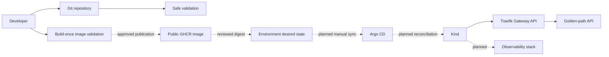

# Platform Engineering Lab

A maintainable reference environment for designing, operating, and validating an internal developer platform from first principles.

## Problem statement

Platform teams need a safe way to evaluate delivery standards, GitOps workflows, policy, and observability without hiding the operational details. This repository will provide that environment while keeping every capability explicit, reproducible, and reviewable.

Phase 0 established repository governance and validation. Phase 1 defines the local Kubernetes baseline. Phase 2 delivers a runtime-validated reference API, secure image contract, Helm packaging, and Gateway API configuration. Phase 3 provides workload and supply-chain validation. Phase 4 repository work defines reviewed digest promotion and manual Argo CD reconciliation; it is not installed or active yet.

## Platform capabilities

The following capabilities are planned and will be delivered incrementally:

- Reproducible local Kubernetes with kind
- Helm-based application packaging and a documented workload contract
- Argo CD reconciliation and environment promotion through Git
- Metrics, dashboards, alerting, and reliability exercises
- Kubernetes admission policy and workload isolation
- Reusable service onboarding and an optional developer portal
- An optional cloud implementation using Terraform

## Architecture



Solid lines describe implemented repository workflows; they do not claim that runtime components are installed. Dashed lines are planned capabilities. See the [architecture overview](docs/architecture/overview.md) for boundaries and ownership.

## Technology stack

| Area | Technology | Status |
| --- | --- | --- |
| Repository automation | Make and portable shell | Available in Phase 0 |
| Local Kubernetes | kind and kubectl | Phase 1 repository implementation available |
| Packaging | Helm | Phase 2 implemented and runtime-validated |
| Local routing | Traefik and Gateway API | Phase 2 implemented and runtime-validated |
| Supply-chain validation | GitHub Actions, Trivy, CycloneDX | Phase 3 complete |
| Infrastructure | Terraform and Ansible | Reserved for later phases |
| Continuous delivery | Argo CD | Phase 4 repository implementation under review |
| Policy | Kyverno | Planned for Phase 6 |
| Observability | Prometheus and Grafana | Planned for Phase 5 |

## Roadmap

0. **Repository foundation:** complete—governance, documentation, ADRs, diagnostics, and safe validation.
1. **Kubernetes baseline:** complete—three-node kind cluster, guarded lifecycle, isolation, and runtime validation.
2. **Golden-path workload:** complete—reference API, secure container, Helm release, Gateway API routing, isolation, and runtime recovery validation.
3. **Continuous integration:** complete—build-once image flow, hash-locked dependencies, SBOM, vulnerability policy, attestations, and automated update proposals.
4. **GitOps:** repository implementation under review—public GHCR publication, reviewed digest promotion, and manual Argo CD reconciliation are not active yet.
5. **Observability and reliability:** planned metrics infrastructure, dashboards, alerts, and failure exercises.
6. **Policy and security:** planned admission controls and workload standards.
7. **Self-service and cloud extensions:** planned templates, optional portal, and managed infrastructure.

## Development status

**Phase 2 has been runtime-validated and Phase 3 CI completed at its recorded revision. Phase 4 repository implementation is under review.** A fresh clone still requires explicit cluster and workload installation. No image publication, promotion, Argo CD installation, or GitOps adoption is implied by repository content. The project does not claim production readiness.

## Prerequisites

Repository validation requires Git, GNU Make, kubectl, and a POSIX-like shell. Cluster creation additionally requires a reachable Docker runtime and stable kind v0.31.0. Supported versions are listed in the [tooling reference](docs/reference/tooling.md).

## Quick start

Validate the repository without changing a cluster:

```sh
make help
make doctor
make validate
```

`make doctor` inspects the environment without installing software or changing machine or cluster state.

After reviewing any existing cluster and persistent data, follow the [cluster creation tutorial](docs/tutorials/create-local-cluster.md). Cluster lifecycle commands are intentionally guarded against the wrong context and arbitrary cluster names.

The [golden-path deployment tutorial](docs/tutorials/deploy-golden-path-application.md) separates repository validation from image builds and cluster mutations.

`make ci-check` runs the non-cluster CI contracts. The [supply-chain validation tutorial](docs/tutorials/validate-application-supply-chain.md) explains the Docker-backed image, SBOM, and vulnerability gates.

## Security principles

- Prefer least privilege and deny-by-default controls.
- Keep credentials and private material out of Git.
- Pin third-party automation to immutable versions.
- Validate changes before they reach runtime environments.
- Separate bootstrap authority from continuously reconciled state.
- Introduce policy in audit mode before enforcement where appropriate.

See [SECURITY.md](SECURITY.md) for reporting and handling vulnerabilities.

## Documentation

- [Architecture overview](docs/architecture/overview.md)
- [Local Kubernetes architecture](docs/architecture/local-kubernetes.md)
- [Golden-path application architecture](docs/architecture/golden-path-application.md)
- [Continuous integration architecture](docs/architecture/continuous-integration.md)
- [GitOps delivery architecture](docs/architecture/gitops-delivery.md)
- [Architecture decisions](docs/architecture/decisions/0001-use-kind-for-local-kubernetes.md)
- [Cluster creation tutorial](docs/tutorials/create-local-cluster.md)
- [Cluster reference](docs/reference/cluster.md)
- [Application reference](docs/reference/application.md)
- [Gateway API reference](docs/reference/gateway.md)
- [Continuous integration reference](docs/reference/continuous-integration.md)
- [GitOps reference](docs/reference/gitops.md)
- [Platform engineering concept](docs/concepts/platform-engineering.md)
- [Tooling reference](docs/reference/tooling.md)
- [Troubleshooting](docs/troubleshooting.md)

## Contributing

Contributions are welcome through focused issues and pull requests. Read [CONTRIBUTING.md](CONTRIBUTING.md), the [Code of Conduct](CODE_OF_CONDUCT.md), and the [security policy](SECURITY.md) before contributing.

This project is licensed under the [Apache License 2.0](LICENSE).
