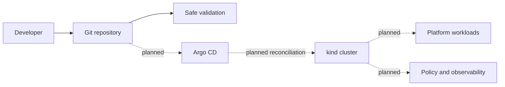

# Platform Engineering Lab

A maintainable reference environment for designing, operating, and validating an internal developer platform from first principles.

## Problem statement

Platform teams need a safe way to evaluate delivery standards, GitOps workflows, policy, and observability without hiding the operational details. This repository will provide that environment while keeping every capability explicit, reproducible, and reviewable.

Phase 0 established repository governance and validation. Phase 1 now defines the local Kubernetes baseline; cluster runtime state remains independently verifiable and is never inferred from repository content.

## Platform capabilities

The following capabilities are planned and will be delivered incrementally:

- Reproducible local Kubernetes with kind
- Helm-based application packaging and a documented workload contract
- Argo CD reconciliation and environment promotion through Git
- Metrics, dashboards, alerting, and reliability exercises
- Kubernetes admission policy and workload isolation
- Reusable service onboarding and an optional developer portal
- An optional cloud implementation using Terraform

## Architecture



Solid lines describe Phase 0. Dashed lines are planned capabilities. See the [architecture overview](docs/architecture/overview.md) for boundaries and ownership.

## Technology stack

| Area | Technology | Status |
| --- | --- | --- |
| Repository automation | Make and portable shell | Available in Phase 0 |
| Local Kubernetes | kind and kubectl | Phase 1 repository implementation available |
| Packaging | Helm | Planned for Phase 2 |
| Infrastructure | Terraform and Ansible | Reserved for later phases |
| Continuous delivery | Argo CD | Planned for Phase 4 |
| Policy | Kyverno | Planned for Phase 6 |
| Observability | Prometheus and Grafana | Planned for Phase 5 |

## Roadmap

1. **Repository foundation:** complete—governance, documentation, ADRs, diagnostics, and safe validation.
2. **Kubernetes baseline:** in progress—configuration and guarded automation are available; runtime validation is pending.
3. **Golden-path workload:** reference service and Helm packaging.
4. **Continuous integration:** workload and supply-chain validation.
5. **GitOps:** Argo CD reconciliation and promotion.
6. **Observability and reliability:** metrics, dashboards, alerts, and failure exercises.
7. **Policy and security:** admission controls, isolation, and workload standards.
8. **Self-service and cloud extensions:** templates, optional portal, and managed infrastructure.

## Development status

**Phase 1 repository implementation is available.** It defines a three-node local kind cluster, isolated namespaces, and guarded lifecycle operations. This status does not claim that a cluster is currently running or validated. Applications and platform services remain unimplemented, and this project does not claim production readiness.

## Prerequisites

Repository validation requires Git, GNU Make, kubectl, and a POSIX-like shell. Cluster creation additionally requires a reachable Docker runtime and stable kind v0.31.0. Supported versions are listed in the [tooling reference](docs/reference/tooling.md).

## Quick start

Validate the repository without changing a cluster:

```sh
make help
make doctor
make validate
```

`make doctor` inspects the environment without installing software or changing machine or cluster state.

After reviewing any existing cluster and persistent data, follow the [cluster creation tutorial](docs/tutorials/create-local-cluster.md). Cluster lifecycle commands are intentionally guarded against the wrong context and arbitrary cluster names.

## Security principles

- Prefer least privilege and deny-by-default controls.
- Keep credentials and private material out of Git.
- Pin third-party automation to immutable versions.
- Validate changes before they reach runtime environments.
- Separate bootstrap authority from continuously reconciled state.
- Introduce policy in audit mode before enforcement where appropriate.

See [SECURITY.md](SECURITY.md) for reporting and handling vulnerabilities.

## Documentation

- [Architecture overview](docs/architecture/overview.md)
- [Local Kubernetes architecture](docs/architecture/local-kubernetes.md)
- [Architecture decisions](docs/architecture/decisions/0001-use-kind-for-local-kubernetes.md)
- [Cluster creation tutorial](docs/tutorials/create-local-cluster.md)
- [Cluster reference](docs/reference/cluster.md)
- [Platform engineering concept](docs/concepts/platform-engineering.md)
- [Tooling reference](docs/reference/tooling.md)
- [Troubleshooting](docs/troubleshooting.md)

## Contributing

Contributions are welcome through focused issues and pull requests. Read [CONTRIBUTING.md](CONTRIBUTING.md), the [Code of Conduct](CODE_OF_CONDUCT.md), and the [security policy](SECURITY.md) before contributing.

This project is licensed under the [Apache License 2.0](LICENSE).
