# Continuous integration architecture

## Purpose

Phase 3 validates application source, packaging, and supply-chain evidence without contacting Kubernetes. Phase 4 extends main-branch runs with separately gated publication and promotion jobs. The workflow has no path filter, so image-neutral changes still reach a successful `publication not required` conclusion.

```mermaid
flowchart LR
    Change[Pull request or main push] --> Contracts[Repository contracts]
    Contracts --> Build[Unit test and build image once]
    Build --> Archive[Checksummed image archive]
    Archive --> Supply[Secret and vulnerability scans]
    Archive --> SBOM[CycloneDX SBOM]
    Supply --> Reports[Fourteen-day artifacts]
    SBOM --> Reports
    Reports --> Attest[Main-push artifact attestation]
    Attest -. exact manual source-run gate .-> Publish[Verified GHCR publication]
    Publish --> Evidence[Attested promotion evidence]
    Evidence -. separate approval .-> Promote[Reviewed digest promotion PR]
    Promote -. no direct deployment .-> Cluster[Phase 2 cluster]
```

## Trust boundaries

- Workflow permissions default to `contents: read`.
- Artifact and registry-image attestation jobs alone receive `id-token: write` and `attestations: write`.
- Fork pull requests receive no secrets and cannot run through `pull_request_target`.
- The image is built once, exported with a SHA-256 checksum, and consumed unchanged by later jobs.
- Only the manual publication workflow's final publication job receives `packages: write`. It cannot open pull requests, and CI has no kubeconfig, deployment credential, or cluster target.

## Failure behavior

Fixable HIGH or CRITICAL vulnerabilities fail unless an exact, valid, unexpired exception exists. Unfixed findings remain visible in the JSON report and promotion evidence. Publication and promotion also fail on scanner, database, checksum, identity, visibility, linkage, or cryptographic-attestation errors. Superseded runs are cancelled; validation failures are never converted into successful results.

The Phase 3 closeout recorded 5 unfixed Critical and 31 unfixed High findings. Promotion preserves and displays the current rescan totals; it reports any change rather than assuming those historical counts remain current. No exception is created by Phase 4.

An optional disposable-cluster integration workflow is reserved for a later, separately approved extension. `ci-integration` is intentionally not implemented in this phase.
