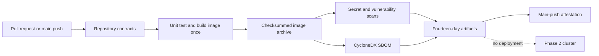

# Continuous integration architecture

## Purpose

Phase 3 validates application source, packaging, and supply-chain evidence without contacting Kubernetes or publishing an image. The workflow runs for every pull request, every push to `main`, and manual requests. It has no path filter, so a required check always reaches a conclusion.

## Trust boundaries

- Workflow permissions default to `contents: read`.
- The attestation job alone receives `id-token: write` and `attestations: write`.
- Fork pull requests receive no secrets and cannot run through `pull_request_target`.
- The image is built once, exported with a SHA-256 checksum, and consumed unchanged by later jobs.
- CI has no kubeconfig, deployment credentials, registry publication permission, or cluster target.

## Failure behavior

Fixable HIGH or CRITICAL vulnerabilities fail unless an exact, valid, unexpired exception exists. Unfixed findings remain visible in the JSON report but do not initially fail the workflow. Superseded runs are cancelled; validation failures are never converted into successful results. Attestation is best-effort because repository-level feature availability must not hide the primary validation result.

An optional disposable-cluster integration workflow is reserved for a later, separately approved extension. `ci-integration` is intentionally not implemented in this phase.
