# GitOps delivery architecture

## Purpose

Phase 4 separates artifact production, environment intent, and reconciliation. Image changes publish one verified archive. Chart-only changes preserve the approved image and promote only a chart revision. Desired-state changes never trigger another promotion.

```mermaid
flowchart LR
    Source[Image input change] --> Build[Build once]
    Build --> Evidence[SBOM, scan, attestations]
    Evidence --> Publish[Public GHCR image]
    Publish --> Verify[Digest rescan and verification]
    Verify --> PR[Promotion pull request]
    PR --> State[Environment desired state on main]
    State --> Root[Root Application detects change]
    Root -->|manual stage 1| Child[Child Application becomes OutOfSync]
    Child -->|manual stage 2| Workload[Golden Path API]
```

Chart changes do not publish an image; they open a reviewed configuration-promotion PR that changes only `chartRevision`. Documentation and `environments/local` changes neither publish nor promote. Mixed image-and-chart changes follow the image path and update both identities. An image-only promotion preserves the previously approved chart revision; the first image promotion uses its source revision because no earlier chart identity exists.

## Reconciliation boundary

The manually bootstrapped `platform-environment` root Application tracks `main` and the exact `environments/local/gitops/applications` path. Tracking `main` provides change detection only. Operator diff and sync resolve `origin/main` once to a complete `environmentRevision`, render and checksum the child specification from that commit, and pass the immutable revision explicitly to Argo. Its `platform-bootstrap` project permits only child Application resources in `gitops`. It cannot manage Secrets, namespaces, CRDs, cluster RBAC, Deployments, Services, or application workloads.

The child `golden-path-api` Application uses the separate `platform-apps` project. That project constrains the repository, cluster, namespace, and workload resource kinds. Both dedicated projects use an empty cluster-resource allowlist and exact namespaced-resource allowlists; neither can manage any cluster-scoped kind. AppProject cannot constrain a repository subdirectory, so repository validation and guarded automation enforce both environment and chart paths.

The application chart owns resources only in `platform-apps`. Its ingress policy permits an explicitly labelled metrics client from `observability`, but the matching egress policy is a uniquely named temporary fixture owned by the guarded network test. Keeping that fixture outside permanent desired state avoids cross-namespace workload ownership while preserving the isolation proof.

Controller installation retains Argo CD's built-in `default` AppProject but replaces its permissions with a repository-owned deny-all specification. It contains no permitted repositories, destinations, or resource kinds. This prevents an unreviewed Application from bypassing the dedicated bootstrap and workload project boundaries.

The application controller uses Argo CD's `resource.respectRBAC: normal` cache mode. It watches only resources its exact Kubernetes RBAC permits and stops watching unrelated APIs after an authorization denial. This avoids granting cluster-wide read visibility or maintaining a growing exclusion list as CRDs change.

Synchronization has two manual stages. First, the root diff updates only the child Application specification. Second, a separate child diff updates workload resources. Automatic synchronization, self-healing, pruning, cascading-deletion finalizers, and namespace creation are absent at both levels.

Three revisions have separate meanings:

- `environmentRevision`: commit containing the reviewed environment Application definition.
- `chartRevision`: commit containing the reviewed Helm chart.
- `imageSourceRevision`: commit used to build the reviewed image.

The OCI revision must equal the image source revision, while the child chart source uses the chart revision. A chart-only promotion can therefore change configuration without relabelling or rebuilding the image.

The complete approved child `spec` is serialized as canonical JSON and hashed with SHA-256. Root diff displays this checksum; root sync includes it in confirmation and requires the live child specification to reproduce it exactly. If `origin/main` advances after an older immutable revision is synchronized, the root correctly returns to OutOfSync and waits for another review.

The Argo API server is ClusterIP-only, has no Gateway route, and has its built-in administrator disabled. Core-mode CLI operations use the operator's existing Kubernetes authentication.

## Controller API boundary

kindnet evaluates cross-node Kubernetes API egress against kube-proxy's translated control-plane endpoint in this lab. Installation therefore discovers one Ready endpoint, verifies it against the control-plane node, Docker network, and kube-apiserver, then renders exact `/32` policies for only the Redis hook, application controller, and API server. Those three consumers are required to run on workers. Repository server, Redis, and unlabelled Pods receive no API access.

Snapshots A, B, and C bind discovery, pre-Helm, and post-Helm state to one canonical SHA-256 identity. Any endpoint or identity change stops the operation without widening or retrying. This is a kind/kindnet-specific response to implementation-dependent Service DNAT behavior, not a portable assumption about all CNIs.

## Ownership transition

The original Helm release record remains as historical evidence. The Helm guard activates when the live Deployment carries the child Application's annotation-based Argo tracking identity—not merely when the child object exists. Neither Argo Application has a cascading-deletion finalizer, so removing the root leaves the child, and removing the child leaves workload resources. Reversal validates those orphaned resources and explicitly restores guarded Helm ownership without editing the Helm release Secret.
