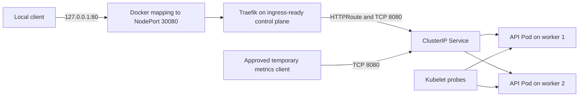

# Golden-path application architecture

Phase 2 defines a stateless FastAPI service, a secure image contract, Helm packaging, and Gateway API routing. Runtime installation remains a separate, explicitly approved operation.

## Ownership

- `platform-system` owns Traefik, its GatewayClass integration, and `platform-gateway`.
- `platform-apps` owns the application release, Service, HTTPRoute, PDB, and application NetworkPolicy.
- The Gateway listener uses an explicit namespace selector that accepts HTTPRoutes only from `platform-apps`.
- The application HTTPRoute exposes only the exact `/` path. Health and metrics endpoints remain internal.

## Scheduling and recovery

Two replicas are restricted to worker nodes. A hostname topology constraint uses `ScheduleAnyway`: Kubernetes prefers separate workers but may colocate replicas when a worker is unavailable. The PDB preserves one replica during voluntary disruption; it does not make the single-control-plane cluster highly available.

## Autoscaling

The chart includes an `autoscaling/v2` HPA template for contract validation. `autoscaling.enabled` defaults to `false` because the cluster has no Metrics Server. A later phase may add a resource metrics API and deliberately enable it.
