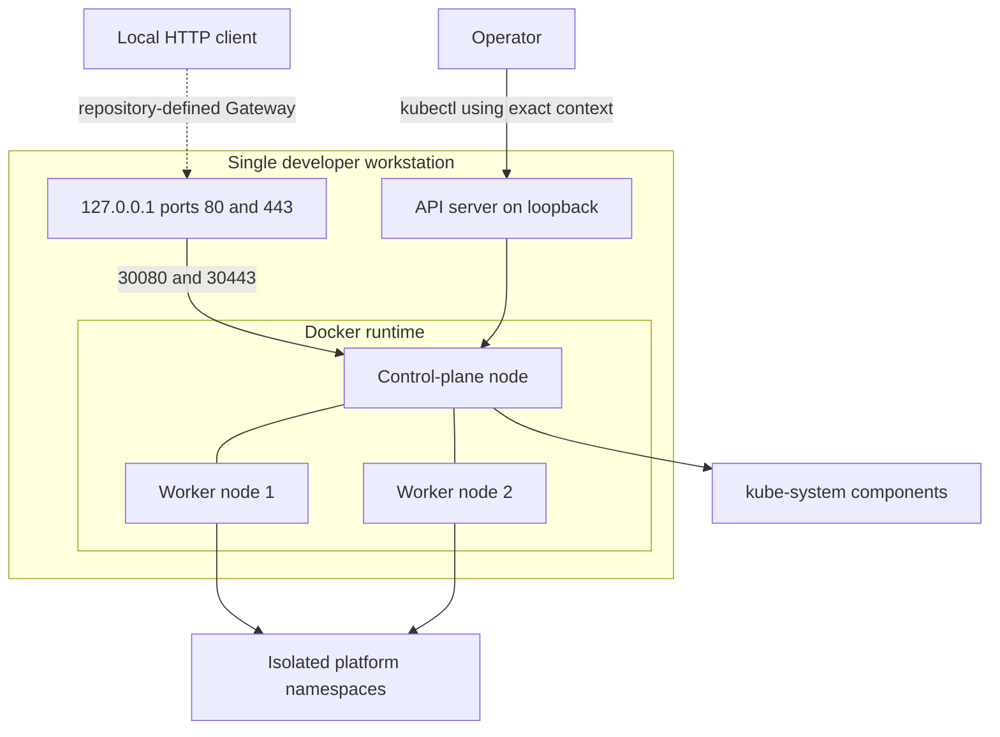

# Local Kubernetes architecture

## Purpose

The Phase 1 cluster provides a reproducible Kubernetes baseline for local platform development. It runs entirely in Docker through kind and has no cloud dependency.

## Topology

The cluster has one control-plane node and two workers. This allows scheduling and node-failure exercises without presenting the cluster as highly available. The control plane is a single point of failure.

All nodes are containers on one workstation. They share the host's CPU, memory, storage, network, kernel, power, and Docker runtime. Production Kubernetes normally distributes control-plane and worker nodes across independent failure domains and uses replicated control-plane and storage services.

## Network boundaries

The API server, HTTP, and HTTPS mappings bind only to `127.0.0.1`. Docker maps host ports 80 and 443 to control-plane container ports 30080 and 30443. Those internal ports are reserved for Traefik's fixed NodePort Service; the user-facing localhost addresses do not change. The cluster uses IPv4, Pod subnet `10.244.0.0/16`, and Service subnet `10.96.0.0/16`.

The control-plane node carries `ingress-ready=true`, which schedules the Phase 2 Traefik Gateway controller. Phase 1 reserves ports but does not install that controller. The maintained lab has the current mappings; older clusters still require inventory and separate recreation approval because kind port mappings are immutable.

Owned namespaces begin with default-deny ingress and egress. DNS queries to CoreDNS over TCP and UDP port 53 are the only initial exception. Later components must add narrowly scoped rules for application ingress, metrics collection, Git access, Kubernetes API access, and approved service dependencies.

## Storage boundary

The baseline relies on kind's default local-path StorageClass when exactly one default class is present. It does not install a second provisioner. Local persistent volumes are not replicated and are deleted with the cluster.

## Security boundary

`platform-apps` enforces the Restricted Pod Security Standard. Controller namespaces enforce Baseline while warning and auditing against Restricted. Kubernetes system namespaces are not modified.
