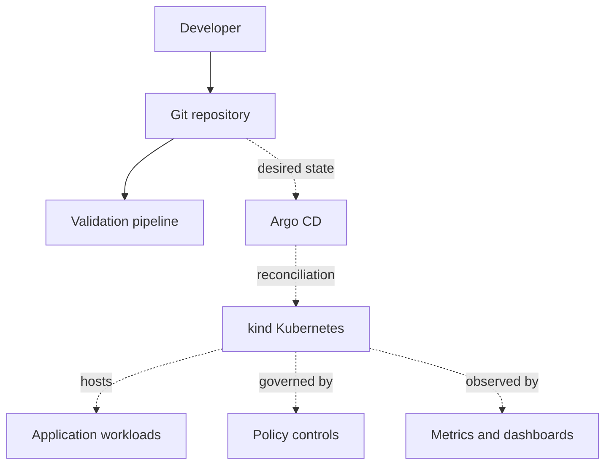

# Architecture overview

## Purpose

Platform Engineering Lab is a reference environment for evaluating platform contracts and operating practices. It favors transparent components and version-controlled state over opaque automation.

Only the repository foundation exists today. The runtime architecture below records intended boundaries and must not be interpreted as a deployed system.

## Planned system context

## Architectural boundaries

- **Repository foundation:** governance, decisions, documentation, diagnostics, and validation. This is the current phase.
- **Bootstrap:** creates a local cluster and the minimum GitOps entry point. Planned.
- **Platform services:** ingress, policy, monitoring, and shared cluster capabilities. Planned.
- **Workloads:** independently packaged applications that consume a documented platform contract. Planned.
- **Infrastructure:** optional provisioning outside Kubernetes. Planned for a cloud extension.

Git will be the source of desired configuration. CI will validate proposed state; Argo CD will eventually reconcile accepted state. Direct cluster access remains a diagnostic and recovery mechanism rather than the normal delivery path.

## Quality attributes

- **Reproducibility:** versions and inputs are explicit.
- **Security:** least privilege, immutable dependencies, and secret-free Git history.
- **Operability:** health, ownership, failures, and recovery paths are visible.
- **Portability:** local concepts transfer to managed Kubernetes without forcing identical infrastructure.
- **Approachability:** one supported path is documented before optional alternatives.

## Decisions

- [ADR-0001: Use kind for local Kubernetes](decisions/0001-use-kind-for-local-kubernetes.md)
- [ADR-0002: Use Helm for application packaging](decisions/0002-use-helm-for-application-packaging.md)
- [ADR-0003: Use Argo CD for GitOps](decisions/0003-use-argo-cd-for-gitops.md)
- [ADR-0004: Use a phased platform architecture](decisions/0004-use-a-phased-platform-architecture.md)
