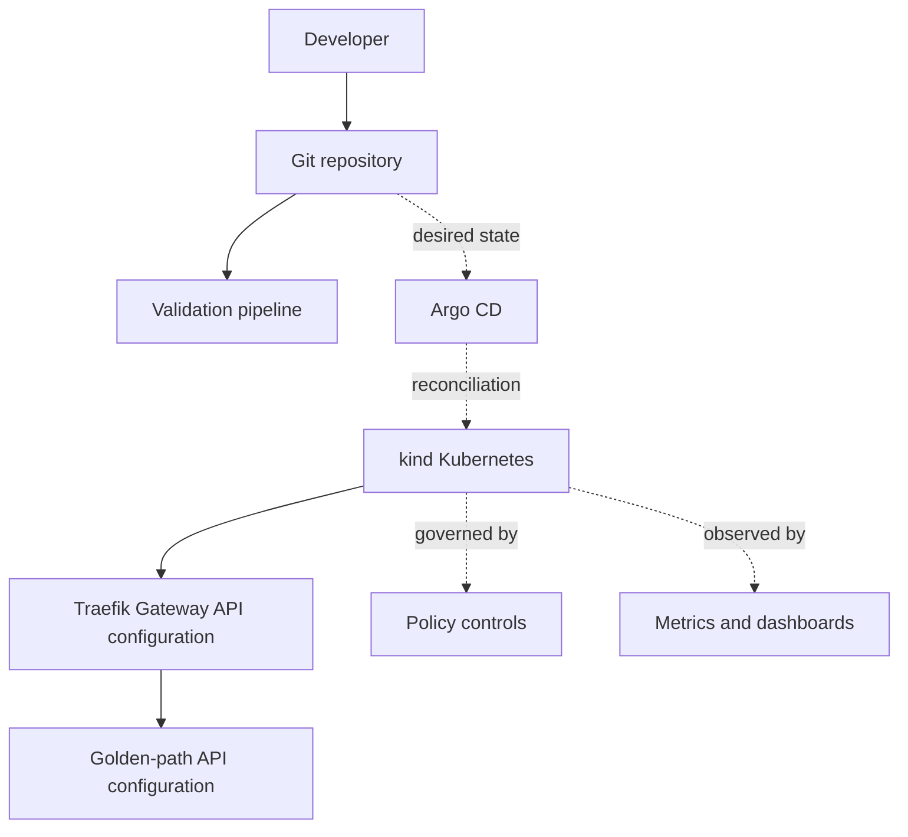

# Architecture overview

## Purpose

Platform Engineering Lab is a reference environment for evaluating platform contracts and operating practices. It favors transparent components and version-controlled state over opaque automation.

Phase 1 defines a reproducible local Kubernetes baseline. Phase 2 defines a runtime-validated reference workload and Gateway API delivery path. Phase 3 validates workload and supply-chain artifacts without contacting Kubernetes. Phase 4 repository contracts add verified publication, reviewed digest promotion, and manual Argo CD reconciliation; they remain uninstalled until separate runtime approval.

## Planned system context

## Architectural boundaries

- **Repository foundation:** governance, decisions, documentation, diagnostics, and validation. Implemented.
- **Kubernetes baseline:** defines a guarded three-node local cluster, namespaces, and baseline controls. Repository implementation is available; runtime state is environment-dependent.
- **GitOps bootstrap:** repository configuration is defined for a lightweight Argo CD installation; no installation or reconciliation is implied.
- **Platform services:** Traefik and Gateway API routing were runtime-validated in Phase 2; policy and monitoring services remain planned.
- **Workloads:** the independently packaged golden-path API was runtime-validated in Phase 2; deployment remains environment-specific.
- **Delivery validation:** Phase 3 builds one immutable image, validates its contract, produces a CycloneDX SBOM, and enforces the vulnerability policy without deployment credentials.
- **Infrastructure:** optional provisioning outside Kubernetes. Planned for a cloud extension.

Git is the proposed source of desired configuration. CI validates proposed state; once separately installed and adopted, Argo CD will reconcile only explicitly synchronized state. Direct cluster access remains a diagnostic and recovery mechanism rather than the normal delivery path.

## Quality attributes

- **Reproducibility:** versions and inputs are explicit.
- **Security:** least privilege, immutable dependencies, and secret-free Git history.
- **Operability:** health, ownership, failures, and recovery paths are visible.
- **Portability:** local concepts transfer to managed Kubernetes without forcing identical infrastructure.
- **Approachability:** one supported path is documented before optional alternatives.

## Decisions

- [ADR-0001: Use kind for local Kubernetes](decisions/0001-use-kind-for-local-kubernetes.md)
- [ADR-0002: Use Helm for application packaging](decisions/0002-use-helm-for-application-packaging.md)
- [ADR-0003: Use Argo CD for GitOps](decisions/0003-use-argo-cd-for-gitops.md)
- [ADR-0004: Use a phased platform architecture](decisions/0004-use-a-phased-platform-architecture.md)
- [ADR-0005: Use a three-node local cluster](decisions/0005-use-a-three-node-local-cluster.md)
- [ADR-0006: Reserve local HTTP and HTTPS ports](decisions/0006-reserve-local-http-and-https-ports.md)
- [ADR-0007: Isolate platform namespaces](decisions/0007-isolate-platform-namespaces.md)
- [ADR-0008: Constrain local workload resources](decisions/0008-constrain-local-workload-resources.md)
- [ADR-0009: Use Python and FastAPI for the reference API](decisions/0009-use-python-and-fastapi.md)
- [ADR-0010: Use a minimal non-root application container](decisions/0010-use-a-minimal-container.md)
- [ADR-0011: Package the reference application with Helm](decisions/0011-package-applications-with-helm.md)
- [ADR-0012: Use Traefik with Kubernetes Gateway API](decisions/0012-use-traefik-with-gateway-api.md)
- [ADR-0013: Build an application image once in CI](decisions/0013-build-an-application-image-once-in-ci.md)
- [ADR-0014: Generate an SBOM and enforce vulnerability policy](decisions/0014-generate-an-sbom-and-enforce-vulnerability-policy.md)
- [ADR-0015: Separate CI validation from deployment](decisions/0015-separate-ci-validation-from-deployment.md)
- [ADR-0016: Publish application images publicly to GHCR](decisions/0016-publish-images-to-ghcr.md)
- [ADR-0017: Run a lightweight pinned Argo CD installation](decisions/0017-run-lightweight-argo-cd.md)
- [ADR-0018: Promote immutable digests through reviewed pull requests](decisions/0018-promote-digests-through-reviewed-pull-requests.md)
